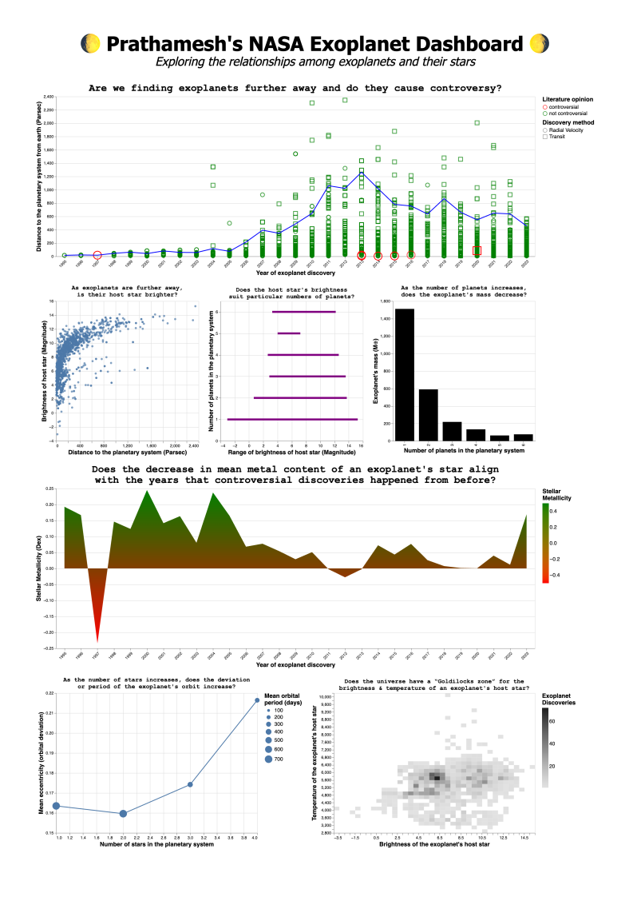

# Visualizing data from the official NASA exoplanet archive

This repository contains my Python code to visualize data from the official NASA exoplanet archive which can be found [here](https://exoplanetarchive.ipac.caltech.edu/cgi-bin/TblView/nph-tblView?app=ExoTbls&config=PS/). Details about my implementation are noted in my [report](report.pdf).

# Requirements
I used Python 3.9 for this visualization. The packages used for this project can be found in the virtual environment. You can activate it by running the command below for Linux/MacOS:

```
source venv/bin/activate
```


# How to run
```
python3 exoplanet_visualization.py
```

# Final visualization

